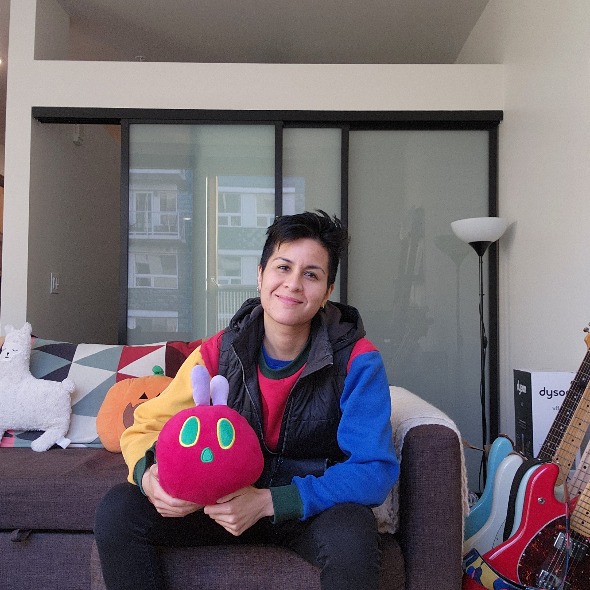

  

Hi, I'm Georgia — a scientist, musician, and Australian living in Seattle.

## About me

I'm a postdoctoral researcher in computational genetics at the University of Washington, where I build statistical tools to understand how genetic mutations arise and evolve across individuals, populations, and species. My current work focuses on analyzing genomic data from an endangered bird species, with the goal of extending these methods to other ecological datasets.

**Current work:** Postdoctoral scholar in Kelley Harris' lab at UW Genome Sciences, collaborating with Nancy Chen's lab at UCLA. I design and implement methods for large-scale genomic data analysis, develop reproducible tools for novel genomic data structures, and co-supervise graduate students.

**PhD:** I earned my PhD in Statistics from the University of Melbourne, where I was a core contributor to [tskit](https://tskit.dev/) and [stdpopsim](https://tskit.dev/software/stdpopsim.html) — foundational open-source Python packages for tree sequence genetics. These tools are now used by tens of thousands of researchers worldwide. I also applied machine learning methods to infer demographic history from Indigenous Australian genomes, in collaboration with the National Centre for Indigenous Genomics.

For a detailed résumé, find me on [LinkedIn](https://www.linkedin.com/in/georgia-tsambos-47984073/).

## Music

Outside the lab, I'm a keen guitarist. Since the pandemic, most of the action has happened on [Instagram](https://www.instagram.com/georgiaplaysguitar/), but while I'm in Seattle for my postdoc, I'm taking advantage of the deep musical history of my new home by immersing myself in local community:

 - I'm a semi-regular at the open-mic jams at Nectar Lounge and Human People.
 - I've volunteered as a guitar, bass, and band instructor at events for Rain City Rock Camp, a music nonprofit in Seattle.
 - I also volunteer as a guitarist in the house band for the Royal Room's seasonal "Women In Blues" and "Women In Country" community events, with proceeds from my appearances donated by the venue to Rain City Rock Camp and Northwest Harvest.

See my [upcoming and past shows](/shows).
